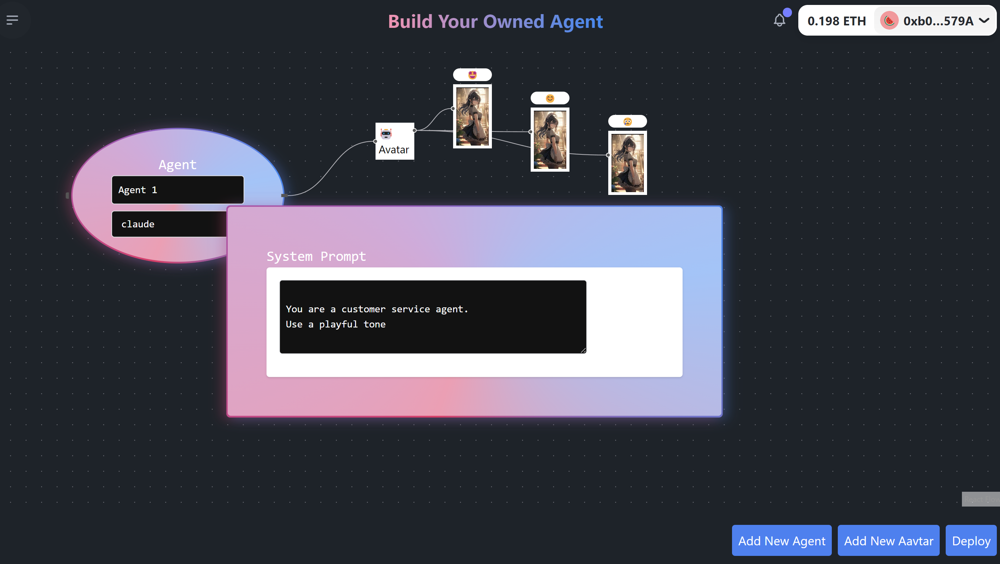

# BYOA

Build Your OWNED Agent

## Short description
BYOA is a no-code tool to create on-chain trustless AI agents. From naughty dogs NPC in autonomous world that integrate with your game server, to customer service chatbots powered by LLM. 

## Description

With drag and drop, you are able to customize your agent with different emotion expressions with generative AI. 

You can setup rules for AI to deterministically decide its action, such as selecting from a list of optionns or more complicated state machine. Such behaviours will be added onto the contract template to create a trustless, immutable contract when deployed. 

You can talk to each agent which is empowered by XMTP. One example is the NPC will send you a message when he steps on a poop 💩 in the game, and you can see she becomes angry on the on-chain avatar.

 

It is also possible to configure external plugins such as chainlink function to integrate an external game server, to maximize use cases of agents.

In the the game demo, all you need to do is to fund them and they will be walking in the garden, at their wish accordingly behaviour you configured.  

Every interaction driven by contract rules with events on-chain.

on-chain AI agents provide guardrails and trustless mechanisms.

<!-- each genearte = 6511, immediate airdrop -->

## How it's made

BYOA supports deploying agents on EVM networks, namely we provide templates deployable for
- Sepolia (Testnet)
 - 
- Galadriel (L1 for Ai)
   - access to oracle

With use of chainlink functions, it is possible to external web2 APIs such as a custom game server in case of NPCs.

- XMTP is used to community between user and agents. An inbox account is created for each agent.
- Once XIP-44 is implemented, messages can be sent to/from contract account of Agent directly

## Potentials
- We could further expand customizing of agents, such as using Controlnet with stable diffusion to automatically create different expressions for an agent.  

## dependencies
- ethers v5 is required for lit as mentioned [here](https://developer.litprotocol.com/sdk/serverless-signing/quick-start#set-up-a-controller-wallet)
  - note issues like this https://github.com/ethers-io/ethers.js/issues/4469#issuecomment-1987163709
  - unsure how to skipFetchSetup in v6

## testing XMTP
- wallets need to be registered.
- Note there is production / dev network 
- use either one of below to connect and sign up
  - https://app-preview.converse.xyz/
  - https://xmtp-quickstart-reactjs.vercel.app/
- https://dev.xmtp.chat/
- Run at local https://github.com/ephemeraHQ/converse-app

## testing Lit
- to generate a PKP public key, try https://lit-pkp-auth-demo.vercel.app/

- Developement is on [Chronicle Yellowstone](https://developer.litprotocol.com/connecting-to-a-lit-network/lit-blockchains/chronicle-yellowstone).
 - add the network and claim on faucet

 ## dependencies
 - noble v2+ use web crypto   https://github.com/paulmillr/noble-secp256k1/releases/tag/2.1.0

 ## Contracts

- Note pre-built contracts are committed to the codebase 
- on changes
 - cd packages/contract
 - forge build
 - ABI and binary output at e.g. out/Contract.sol/Contract.json

- Note with galadriel, at forge build/script, compile with solc 0.8.25 and `--via-ir` https://book.getfoundry.sh/reference/forge/forge-build
  - otherwise error `Compiler run failed:
Error (1834): Copying of type struct IOracle.Content memory[] memory to storage not yet supported.`
  - and for >0.8.25 "No memoryguard was present." error as in https://github.com/ethereum/solidity/issues/14358

  
### sample deploy script
#### optimism sepolia
  -  env-cmd -f ../../.env forge script scripts/deploy.s.sol --via-ir  --broadcast  --rpc-url https://sepolia.optimism.io  --gas-price 1000 --gas-limit 60000000000000000 --verify
  - note to verify, etherscan optimism use differeent `ETHERSCAN_API_KEY`

## Run locally
- Need hosted for the Chainlink function to access
- cloudflared tunnel run <id>

